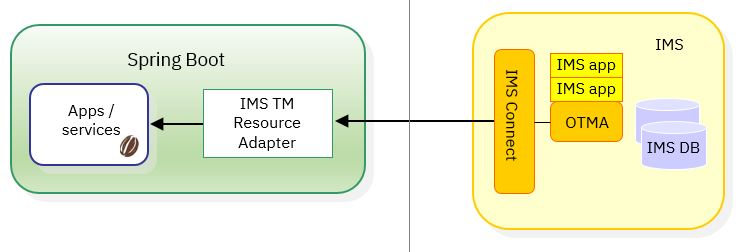
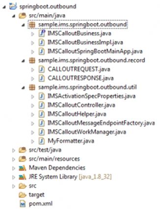

# IMS synchronous callout processing with Spring Boot

In this example, we will demonstrate how to process a synchronous callout from IMS using the IMS TM Resource Adapter and a message-driven bean (MDB) in Spring Boot with Tomcat embedded. 

Spring Boot is a suite of pre-configured frameworks and technologies that make it easy to create a Spring web application that can be up and running on the Spring platform with little configuration.

Samples are provided to demonstrate how to use the Spring Boot auto-configuration feature and some Java helper classes to make IMS TM Resource Adapter work as if it were running in a Java EE application server.


## Program flow and architecture
The following diagram shows the program flow and the components involved. Note that the MDB that processes the 
message from IMS can then call a service, local or external.  However, in this example, the MDB simply processes the 
message from IMS. It does not call any service.



The implementation is based on the IMS documentation that describes how to implement the synchronous callout function using MDBs in a WebSphere Application Server.
 A diagram that illustrates the implementation can be found in the [Implementing synchronous callout function](https://www.ibm.com/support/knowledgecenter/en/SSEPH2_14.1.0/com.ibm.ims14.doc.apg/ims_calloutsynchronous.htm) topic. 
## Featured technologies

* [Spring framework](https://spring.io/): An open source application framework and inversion of control container for the Java platform 
* [Spring Boot](http://projects.spring.io/spring-boot/): Spring boot is a framework developed on top of the Spring framework to ease the development of new Spring applications. 
* [IMS TM Resource Adapter](https://www.ibm.com/support/knowledgecenter/SSEPH2_14.1.0/com.ibm.ims14.doc.tmra/topics/tmresoverview.htm): A Java EE connector architecture (JCA)-compliant resource adapter that allows Java applications or services to access IMS transaction via IMS Connect, or IMS applications to call out to external Java application or services.

## Usage scenario and background information
When you run the IMS TM Resource Adapter in a Java EE application server, an activationSpec is used to configure the relationship between the application server and IMS Connect. This is done with the Java Naming and Directory Interface (JNDI), which provides a name for the MDB to refer to. The MDB is deployed as an Enterprise Archive (EAR), which also refers to the JNDI name

With the Spring Boot auto-configuration from `application.properties` and some Java helper classes, IMS TM Resource Adapter would invoke the MDB business method upon retrieval of a callout message originated from IMS. When Spring Boot is started, it reads the IMS Connect activationSpec configuration, connects to IMS Connect immediately, and waits for messages from IMS. This is similar to starting the MDB in a Java EE application server.

The sample workspace provided contains a sample implementation of a Java business method, similar to a MDB generated by the Rational tooling in the IMS synchronous outbound scenario. The workspace also contains some generic Java classes that allow the use of IMS TM Resource Adapter in Spring Boot similar to deploying a MDB in a Java EE application server. 

For IMS TM Resource Adapter to work in Spring Boot, some helper classes are needed to provide some services that a Java EE application server would normally provide. 
An example would be the thread pool that provides the thread for running the message receivers and, as the callout messages arrive from IMS, 
running the business methods of the MDB concurrently.  These classes are required to be derived from certain interfaces that are part of the .jar 
files included in the IMS TM Resource Adapter.

## System requirements

The description and the samples in this article are based on the following setup:
* IMS V14 and IMS TM Resource Adapter V14.1.4. 
Since IMS TM Resource Adapter V14.1.4 contains several defect fixes, it is strongly recommended that you start with this level of maintenance.  
Download IMS TM Resource Adapter from the <a href="https://www.ibm.com/marketing/iwm/iwm/web/preLogin.do?source=imscjd">IMS downloads page</a>.

* Download the latest Eclipse Development Environment (Eclipse IDE for Java Developers). 
For this sample, oxygen.1 was downloaded and it already contains Maven. Although Eclipse also works with a Java Runtime Environment, Maven builds require a Java Development Kit (or SDK version) to be installed. Keep in mind that the SDK and Eclipse can be either 32-bit or 64-bit versions, but the two need to be the same version. 

* Install Spring Boot. 
For getting started and installation information, see the <a href="https://docs.spring.io/spring-boot/docs/current-SNAPSHOT/reference/htmlsingle/">Spring Boot Reference Guide</a>.

## Workspace and class path
Since the IMS TM Resource Adapter is packaged as a Resource Adapter Archive (.rar) file, it cannot be used as is for development and runtime. You must extract the .rar file (such as by renaming it to a .zip file and then use a suitable tool to extract the content). The required .jar files then need to be added to the workspace class path in the development environment and to the class path in the runtime environment.

Some customers have added the .jar files into their Maven repository for ease of use. Maven builds then add the required IMS TM Resource Adapter jars to the target build (could be jar, war, executable jar or similar).

The following is a list of .jar files that were found to be required during the implementation of the pool manager in this project. The list is based on IMS TM Resource Adapter version 14.1.4. Names might vary in other versions.

* `imsico.jar`
* `ccf2.jar`
* `j2ee.jar` <br/>
   <b>Note</b>: Use only outside of Tomcat/Spring Boot. It is found that an older version of javax.servlet classes could cause exceptions. In Spring Boot, use the dependency groupid javax.resource artifactid javax.resource-api version 1.7.
* `despi.jar`
* `marshall.jar`
* `CWYBS_AdapterFoundation-DUP1.jar`
* `icu4j-59_1.jar` <br/>
   <b>Note</b>: The public dependency groupid com.ibm.icu artifactid icu4j version 59.1 can be used too.

Any convenient method of choice can be used if the .jar files are part of the development environment and the run time.

To install these .jar files into the local Maven repository, commands like the following can be run:
`mvn install:install-file -Dfile=imsico.jar -DgroupId=com.ibm.ims -DartifactId=imsico -Dversion=14.1.4 -Dpackaging=jar`

The command above only runs successfully if the following conditions are met:
*	There is a local Maven command installation.
* The command is run from the directory where the .jar files from the IMS TM Resource Adapter .rar file were extracted.  
* The following .jar files are deployed for use with Spring Boot:

 <table>
   <tr>
   <td><b>File</b></td> <td><b>groupId</b></td> <td><b>artifactId</b></td> <td><b>Version</b></td>
   </tr>
   <tr>
   <td>`imsico.jar`</td> <td>com.ibm.ims</td> <td>imsico</td> <td>14.1.4</td>
   </tr>
   <tr>
   <td>`ccf2.jar`</td> <td>com.ibm.ims</td> <td>ccf2</td> <td>14.1.4 </td>
   </tr>
   <tr>
   <td>`despi.jar`</td> <td>com.ibm.ims</td> <td>despi</td> <td>14.1.4</td>
   </tr>
   <tr>
   <td>`marshall.jar`</td> <td>com.ibm.ims</td>  <td>marshall</td> <td>14.1.4</td>
   </tr>
   <tr>
   <td>`CWYBS_AdapterFoundation-DUP1.jar`</td><td>com.ibm.ims</td><td>cwybs-adapterfoundation</td><td>14.1.4</td>
   </tr>
   </table>

If you prefer to work without Maven, the .jar files should be added to the class path manually. If the sample code is used outside Spring Boot, then the `j2ee.jar` file needs to be added as well.

## Development environment
The latest Eclipse Development Environment (Eclipse IDE for Java Developers) version (oxygen.1 at the time of this project) was downloaded and 
it already contains Maven. Although Eclipse also works with a Java Runtime Environment, Maven builds require a Java Development Kit (or SDK version) 
to be installed. Keep in mind that the SDK and Eclipse can be either 32-bit or 64-bit versions, but the two need to be the same version.

In the workspace, create a new Maven project (archtype quickstart) and then add Spring Boot configuration to the `pom.xml` file. 
Provided in this GitHub repository is a sample workspace that can be imported to get started. The required .jar files from IMS TM Resource Adapter 
can also be added to the workspace class path without using Maven (just by manually adding it as external to the workspace class path).

The input and output records for the IMS callout interaction with IMS used in this sample were generated from a COBOL copybook 
(`imscallout.cpy` in the workspace export) with IBM® Rational® Application Developer (Rational Software Architect can also be used) 
by using the <b>J2C</b> -> <b>CICS/IMS Databinding Generator Wizard</b>, using settings codepage 1141, platform z/OS® and compile option TRUNC(BIN).
We will not describe how to create a Spring Boot application here, although the project contains one. 
For more information on Spring Boot and how to get started, refer to tutorials widely available on the Internet. 

The Java main Spring Boot application is shown here:
```
@RestController 
@SpringBootApplication(scanBasePackages={ 
"sample.ims.springboot.outbound.util","sample.ims.springboot.outbound"}) 
public class IMSCalloutSpringBootMain { 

private static final Logger logger = LoggerFactory.getLogger(
   IMSCalloutSpringBootMain.class); 
   @Autowired 
   IMSCalloutHelper imscallouthelper; 
   @RequestMapping("/statistics") 
   String hello() { 
      logger.info("Http Endpoint called."); 
	  return "IMS Callout Statistics.\nProcessed: " + 
	     imscallouthelper.getCalloutCount() + "\nSucessful: " + 
		 imscallouthelper.getSuccessCount(); 
	} 
	
	public static void main(String[] args) throws Exception { 
	   SpringApplication.run(IMSCalloutSpringBootMain.class, args); 
    }
}
```

To be able to obtain information about the processed IMS callout messages, a simple statistics endpoint is provided to return this information. 
Based on the original workspace, this would be the following URL:
 ```
   http://localhost:8080/statistics
 ```

A sample statistics output looks as follows:


In this sample workspace, Spring concepts such as auto configuration, auto wiring, smart lifecycle, and beans are used but not described in detail.

<a name="helper_class"></a>
## Implementing the helper class
For the IMS TM Resource Adapter to work in Spring Boot, some helper classes are needed. 
These classes are required to be derived from certain interfaces that are part of the IBM provided .jar files, as they must provide some services that 
a Java EE application server would normally provide. An example for this is the thread pool that provides the thread for running the message receivers 
and the business methods of the MDB concurrently as the callout messages arrive from IMS. What the helper classes are and what they do will be described here, 
but not the complete code listing. For the complete code, refer to the sample workspace.

### Business method interface and implementation

Assuming there is already an existing MDB that was written or generated. The `onMessage` and `onNotification` methods call a business method, and 
all other code for this sample was created around the business method and its interface declaration.

The block of code below demonstrates the sample interface and the sample implementation that uses the Java classes generated from the input and output copybook that describes the interface between the IMS transaction and the business method.

The sample interface `IMSCalloutBusiness.java` looks as follows:
```
package sample.ims.springboot.outbound;

import sample.ims.springboot.outbound.record.CALLOUTREQUEST;
import sample.ims.springboot.outbound.record.CALLOUTRESPONSE;

//This is the interface declaration for the MDB Business method
public interface IMSCalloutBusiness {

	public CALLOUTRESPONSE IMSCalloutAction(
			CALLOUTREQUEST cALLOUTREQUEST);
}
```

The sample business method implementation in `IMSCalloutBusinessImpl.java` looks like this:
```
public CALLOUTRESPONSE IMSCalloutAction ( CALLOUTREQUEST cALLOUTREQUEST)
{
  //For testing concurrency the execution elapse time was set to 1 second
  long start = System.currentTimeMillis();
  try {
    Thread.sleep(100);
  } catch (InterruptedException e) {
    e.printStackTrace();
  }
  //create new response message
  CALLOUTRESPONSE response = new CALLOUTRESPONSE();
  //fill response message with values
  response.setCalloutdate("15.11.2017");
  response.setCalloutordernum(10);
  response.setCalloutresponsestr("HELLO FROM MDB");
  long stop = System.currentTimeMillis();
  SimpleDateFormat sdf = new SimpleDateFormat("hh:mm:ss.SSS");
  //print out MDB method processing elapse time
  System.out.println("MDB: " + this.toString() + " Elapsetime: " +
    sdf.format(stop-start) + " Input: " + 
    cALLOUTREQUEST.getCalloutrequeststr());
  //return the response to be sent to back to IMS
  return response;
}
```
The sample ignores the input and fills an output record to be sent back to IMS. This requires that the business method provide a stream-able 
record as input and output, and it needs to match the data that is sent and received by IMS for the synchronous callout request.


### Configuration and IMSActivationSpec
In this sample, we want to connect the same MDB to multiple IMS systems. To make that possible, a configuration class needs to be created (`IMSActivationSpecProperties.java`) 
that automatically loads a configuration from the Spring `application.properties` file on startup. It allows loading an array of IMS Connect communication parameters as follows:
```
# one to many IMS ActivationSpec configuration parameters
imscallout.hostname[0]=hostname1.host.com
imscallout.portnumber[0]=9981
imscallout.username[0]=username
imscallout.password[0]=password
imscallout.datastorename[0]=IMS1
imscallout.queuenames[0]=IMS1TOC,IMS1TOC,IMS1TOC,IMS1TEST

imscallout.hostname[1]=hostname2.host.com
imscallout.portnumber[1]=9982
imscallout.username[1]=username
imscallout.password[1]=password
imscallout.datastorename[1]=IMS2
imscallout.queuenames[1]=IMS2TOC,IMS2TOC,IMS2TOC,IMS2TEST

# common IMS ActivationSpec configuration parameters
imscallout.sslenabled=false
imscallout.connectionpoolenabled=true
```
The parameter handling in this sample was split into the IMS Connection parameters and configuration parameters. 
Connection parameters are unique to each IMS system being accessed, and configuration parameters were treated as being used for all IMSActivationSpec objects.  

Since the IMS Parallel TPIPE option was used for testing this sample, the same TPIPE name is specified more than once, resulting 
in having as many receiver threads started as the same TPIPE name is specified (here three threads for the IMSxTOC TPIPE names). 
Feel free to change the way the ActivationSpecs are configured as needed to suit your environment needs.

Spring Boot auto-configuration maps the arrays to Java lists:
```
@Component
@ConfigurationProperties("imscallout") // prefix imscallout, find imscallout.* values
public class IMSActivationSpecProperties {
	
	private static IMSActivationSpec[] imsActivationSpec = null;
	@SuppressWarnings("unused")
	private static final long serialVersionUID = 1L;
	private List hostname;
	private List username;
	private List password;
	private List portnumber;
	private List datastorename;
	private List queuenames;
	private Boolean sslenabled;
...
```
Spring Boot auto-configuration requires setter methods for each of the configuration parameters. More enhanced parameter checking was not implemented in the sample but can be added, e.g. marking parameters as required or specifying defaults. 

The IMSActivationSpecProperties class was enhanced to check if the IMS Connect connection parameter arrays have the same size. If not, a resource exception is thrown:
```
public IMSActivationSpec[] getImsActivationSpec() throws ResourceException {
...
```
For ease of checking variable amounts of array sizes, the `checkIntegersEqual` method was created to take a variable amount of integer primitives as input and is used as follows:
```
if (!checkIntegersEqual(hostname.size(), username.size(), password.size(), portnumber.size(), datastorename.size(), queuenames.size()))
...
	public static boolean checkIntegersEqual(int... integers)
	{
	    int firstValue = integers[0];
	    for (int i = 1; i < integers.length; i++) {
	        if (integers[i] != firstValue) return false;	        
	    }
	    return true;
	}	
}
```
The common configuration parameters (which are not arrays) are simply loaded into single instances and then set into all IMSActivationSpecs during Spring Boot initialization. Upon success, the class returns an array of populated IMSActivationSpec objects that is used to start the message listener endpoints.

### Coding helper classes
To start the listener and the MDB processing, it is required to create and run a hierarchy of classes. The basic structure is illustrated as follows:
```
private IMSEndpointManager endpointManager=null;
private MessageEndpointFactory[] messageEndpointFactory=null;
private WorkManager workManager=null;
private IMSActivationSpec imsActivationSpec=null;

//create workmanager
if (workManager == null) workManager = new IMSCalloutWorkManager();
//based on workmanager and logutils create the endpointManager
if (endpointManager == null) endpointManager = new IMSEndpointManager( 
   workManager, logUtils);
//create the messageEndpointFactory
messageEndpointFactory = new IMSCalloutMessageEndpointFactory();
//add the endpoint to the endpointManager
endpointManager.addEndpoint(messageEndpointFactory,
   imsActivationSpec);
```

Assuming that the imsActivationSpec contains a valid configuration and the helper classes IMSCalloutWorkManager and IMSCalloutMessageEndpointFactory 
are implemented as in the sample workspace, the listener and worker threads have been started after this piece of code was executed.

For the sample workspace starting the listener with Spring lifecycle management (autostart and stop on request) is implemented in class IMSCalloutController. 
For implementation details, see the <a href="#imscalloutcontroller">Implementing IMSCalloutController</a> section.

### Implementing IMSCalloutWorkManager
The IMSCalloutWorkManager class simply implements the WorkManager interface. For use with the IMS TM Resource Adapter, only the `scheduleWork` methods need 
to be implemented. Under the covers the WorkManager interface just creates a thread pool (CachedThreadPool), and scheduleWork is used to start a thread on the thread pool:
```
public class IMSCalloutWorkManager implements WorkManager {
   //static since only one Executor Thread Pool is needed
   public static ExecutorService executor = 
      Executors.newCachedThreadPool(); 
...
public void scheduleWork(Work arg0) throws WorkException {
   executor.execute(arg0);
}

public void scheduleWork(Work arg0, long arg1, ExecutionContext arg2, 
   WorkListener arg3) throws WorkException {
   executor.execute(arg0);	
}
...
```
The WorkManager provides the thread pool and the methods to use it.

### Implementing IMSCalloutMessageEndpointFactory

The IMSCalloutMessageEndpointFactory class simply implements the MessageEndpointFactory interface. 
For use with the IMS TM Resource Adapter, only the `createEndpoint` and `getEndpointClass` methods need to be implemented:
```
public class IMSCalloutMessageEndpointFactory implements 
   MessageEndpointFactory {
	
   IMSCalloutHelper imsCalloutHelper = new IMSCalloutHelper();
   private HashMap executionClassInstanceHashMap = 
      new HashMap();

      //return one instance per Thread, with hashmap based on Threadid
      public synchronized MessageEndpoint createEndpoint(XAResource arg0) 
         throws UnavailableException {
         long threadId = Thread.currentThread().getId();
         if (executionClassInstanceHashMap.containsKey(threadId)) {
            return executionClassInstanceHashMap.get(threadId);
         } else {
            imsCalloutHelper = new IMSCalloutHelper();
            executionClassInstanceHashMap.put(threadId, imsCalloutHelper);
            return imsCalloutHelper;
         }
   }
...
   public Class getEndpointClass() {
      return IMSCalloutHelper.class;
   }	
}
```

Under the covers the IMSMessageEndpointFactory returns an instance of a class that implements the `onMessage` methods that a MDB provides for the synchronous callout 
and execution of the actual business method. Furthermore, to make sure that each thread gets its own instance of the Java business method and helper class objects, 
a Java hash map is used to maintain the relationship between threadID and the helper class object.

To make the sample as usable as possible, a generic class (`IMSCalloutHelper.java`) is provided that implements those MDB methods, searches for a Bean with the name (marked with a spring annotation) “imscalloutimpl” 
and invokes the first method it finds using Java reflection. The invocation of the IMSCalloutHelper class is a hard-coded reference for the `onMessage` method.

### Implementing IMSCalloutHelper

IMSCalloutHelper needs to implement certain interfaces to be executable and callable fromthe IMS TM Resource Adapter:
```
@Component
public class IMSCalloutHelper implements ExtendedMessageListener, 
   InboundListener, MessageEndpoint, ApplicationContextAware {

   private static ApplicationContext context;

   public void setApplicationContext(ApplicationContext 
      applicationContext) throws BeansException {
      context = applicationContext;   
   }

   private Object imsCalloutImpl = null;
   private static AtomicInteger calloutCount = new AtomicInteger(0); 
   private static AtomicInteger successCount = new AtomicInteger(0);
   private static String methodName;
   private static String recordName;
   @SuppressWarnings("rawtypes")
   private Class recordClass;
   @SuppressWarnings("rawtypes")
   private static Class implClass;
```

The ApplicationContextAware interface from Spring, in combination with the declaration of the context and the setter method, sets the Spring context, which is required to query the Bean marked with “imscalloutimpl”.

IMSCalloutHelper, as mentioned, implements the `onMessage` method for processing synchronous callout messages. For this sample, it was chosen that this class uses 
reflection to call the business method that was marked as bean. This means that this class is very generic and can be used as a skeleton. So the only things that need to 
be modified to call other business methods when copying the project are the IMSCalloutBusinessImpl class and the input and output records for interchanging data with 
the IMS transaction calls.

Since the code is quite long, it is not listed here. This class also provides methods to gather statistics about the received and executed methods.
```
public int getCalloutCount() {
	return calloutCount.get();
}

public int getSuccessCount() {
	return successCount.get();
}
```
If the physical connection if not null, the totalConnections counter is decremented.

### Implementing IMSCalloutController
<p id="imscalloutcontroller">The IMSCalloutController class is the heart of the sample project and implements everything that is needed to start the listener as mentioned in the 
<a href="#helper_class">Implementing helper classes</a> section.</p>

It starts as many listener endpoints as there are valid IMS Connect connection parameter array entries in the `application.properties` configuration. 
It implements the automatic startup by using Spring SmartLifeCycle and provides a stop method which shuts down the message endpoint listeners 
when the Spring Boot shutdown endpoint is called.

Stopping the pool connection avoids the HWSP1415E TCP/IP SOCKET FUNCTION CALL FAILED; F=READ error message issued from IMS Connect when 
a persistent reusable socket is closed without notifying IMS Connect.

IMS TM Resource Adapter logging and tracing to a file can be configured here, but if logging.level.com.ibm.j2ca is commented out in `application.properties`, 
it is already prepared for Spring Boot logging to console.


## How to turn on logging for IMS TM Resource Adapter
To be able to see that the connections are reused and for other problem determination purposes, it is useful to know how to turn on logging. 
The following sample shows how to do logging in a J2SE environment (to console, but also works in Eclipse):
```
//turn on logging if required	  
final Logger universalLogger = Logger.getLogger("com.ibm.j2ca.*");
universalLogger.setLevel(Level.FINEST);
try {
     StreamHandler sh = new StreamHandler(
                                 System.out, new SimpleFormatter());
     sh.setLevel(Level.FINEST);
     universalLogger.addHandler(sh);
} catch (Exception e1) {
     e1.printStackTrace();
}
...
//Create LogUtil
LogUtils logUtils = new LogUtils(new IMSResourceAdapter(), true);
//turn on logging if required
logUtils.setLogger(universalLogger);
...
//turn on logging if required
mcf.setLogUtil(logUtils);
```

Note that the log level needs to be set on both the logger instance and the stream handler. The following sample shows how to do logging in a J2SE environment (to a file):
```
//turn on logging if required	  
final Logger universalLogger = Logger.getLogger("com.ibm.j2ca.*");
universalLogger.setLevel(Level.FINEST);
try {
     FileHandler fh = new FileHandler("C:\\IMSTMRATrace.txt");
     fh.setFormatter(new SimpleFormatter());
     //fh.setFormatter(new MyFormatter());
     universalLogger.addHandler(fh);
} catch (Exception e1) {
     e1.printStackTrace();
}
...
//Create LogUtil
LogUtils logUtils = new LogUtils(new IMSResourceAdapter(), true);
//turn on logging if required
logUtils.setLogger(universalLogger);
...
//turn on logging if required
mcf.setLogUtil(logUtils);
```

Note that for the file handler, the log level does not need to be set. 
To display the timestamps in microseconds and the thread ids of the threads that are doing the logging, the class MyFormatter is 
provided as part of the project and can be enabled by removing the comments (and commenting out the use of `SimpleFormatter()`).

Logging in Spring Boot is easy to implement because it does not require creation of a file or stream handler:
```
//IMSTMRA uses java.util.logging
final Logger universalLogger = Logger.getLogger("com.ibm.j2ca");
LogUtils logUtils = new LogUtils(new IMSResourceAdapter(), true);
//using slf4j does not work here, the cast to java.util.logging fails
logUtils.setLogger(universalLogger);			
mcf.setLogUtil(logUtils);
```

In the `application.properties` or `application.yml` file, the logging level needs to be set as follows:
```
logging.level.com.ibm.j2ca=TRACE
```

<b>Notes</b>:
* Spring uses SLF4J log levels, so mapping the correct java.util.logging level is required (e.g. instead of 
FINEST in Spring Boot, TRACE needs to be used). An example is commented out in the `application.yml` file that 
is part of the sample project.
* Spring Boot by default does not log the method names. This is due to the fact that IMS TM Resource Adapter uses a helper method, 
LogUtils, which appears in the log if the %M identifier is used as pattern for the logback (open source project for logging) configuration 
(would be `logback.xml` in the resources directory). For more information, refer to the logback documentation at [https://logback.qos.ch/manual/configuration.html](https://logback.qos.ch/manual/configuration.html)


## Sample project

The sample project is a Maven project exported from Eclipse.  It has the directory and package structure that adheres to Maven projects.



### Package structure
There are three classes in package sample.ims.springboot.outbound:

1. `IMSCalloutBusiness.java` is the interface declaration with just one method.
2. `IMSCalloutBusinessImpl.java` implements the actual business method. 
3. `IMSCalloutSpringBootMainApp.java` is the main entry point for running the spring boot service. It specifies the package names to be scanned at startup and provides the HTTP endpoint for showing statistics. 
  
For the connection to IMS Connect, parameters such as hostname, portnumber, datastore, queuenames (TPIPEs to listen for), username and password are specified in the `application.properties` file in the resources directory (`src/main/resources` in the Maven project). This is where Spring Boot looks for the `application.properties` or `application.yml` file. These parameters need to be adjusted to suit the needs of the IMS system to be used for running imsclout.jcl to send callout messages to the sample Spring Boot application.

For turning on logging, simply enable the logging properties (the "#"character makes it a comment) in the `application.properties` file.

There are six classes in package sample.ims.springboot.outbound.util:

1.	The class `IMSActivationSpecProperties.java` uses Spring auto-configuration to load all properties prefixed imscallout and store them inside the class. A getIMSActivationSpec method returns the IMSActivationSpec array.
2.	This array is used to start the message listener endpoints in `IMSCalloutController.java`. 
3.	`IMSCalloutWorkManager.java` provides the thread pool.
4.	`IMSCalloutMessageEndpointFactory.java` provides the object that implements the MDB methods for execution by the message listener endpoint, which in this example is the generic IMSCalloutHelper.java. 
5.	`IMSCalloutHelper.java` searches for a bean marked with “imscalloutimpl” and invokes the first available method using reflection. The requirement is that the business method provides a streamable record as input and output and it needs to match the data that is send and received by IMS for the synchronous IMS Callout request. 
6.	`MyFormatter.java` is an extension for logging that allows IMS TM Resource Adapter tracing, displaying microsecond timestamps and thread IDs.

The input and output records for the IMS sync callout copybooks generated from COBOL source with the J2C CICS/IMS Data Binding wizard are required.

* Input Record sent from IMS: `CALLOUTREQUEST.java`
* Output Record sent back to IMS: `CALLOUTRESPONSE.java`

The copybook `imscallout.cpy` is provided in the `resources/` directory.
By using Maven build type package, an executable .jar file can be build, which is executable by using the `java -jar` command. This .jar file can run on any Java-enabled platform, including z/OS.


### Invoking the business method from IMS

This IMS callout sample can be tested using the JCL (`imsclout.jcl`) that is included in the `resources/` folder of the sample project. It is preconfigured to execute 10 callout requests. It needs to be adjusted to suit the needs (High Level Qualifier, Proclib, IMS ID, etc.) of the z/OS and IMS system that is used for testing.  It also requires an OTMA callout destination descriptor to be set up with IMS. Here is a sample of a descriptor that is defined in the DFSYDTx IMS proclib member:

````
M DFSOTMA          MULTIRTP=YES                     
D IMB1TOC          TYPE=IMSCON SMEM=YES TMEMBER=IMSB
````

The descriptor can also be created using Type 2 commands. Please note that the parallel tpipe option for IMS was used to test concurrency in this sample project. 
The `application.properties` file has the settings for the tpipes (queuenames) and datastore, which need to be adjusted to the IMS system that is used for testing.


### Gracefully shutting down Spring Boot
To avoid HWSP1415E error messages, it is required to shut down the threads that have been started to process the IMS callout messages. 
For agile development, it is also necessary to orderly stop the processing of IMS callout messages

This is achieved by adding Spring lifecycle management in the `IMSCalloutController.java` class by implementing the SmartLifeCycle interface and the methods it requires. 
For more information, refer to the source code and the comments in the Java source.
The `stop` method will be called if Spring Boot is gracefully shut down. This is achieved by setting some properties in the `application.yml` file that enable the shutdown 
endpoint for Spring Boot and also turn on security to use it.  An HTTP POST request (Firefox RESTer plugin can be used for that) to the endpoint URL 
(without the contextPath property, it's simply '/shutdown`) can now be used to shutdown Spring Boot. Based on the original workspace, the URL to shut down Spring Boot 
 would be something like this:
```
http://localhost:8080/shutdown
```

Keep in mind that a POST request cannot be done from the URL bar in the browser (only GET requests are possible).

## Summary
In this sample, a sample project for IMS TM Resource Adapter implementation was shared for exploitation of IMS callout MDBs to act as a Java endpoint application in a non-Java EE runtime environment. 

