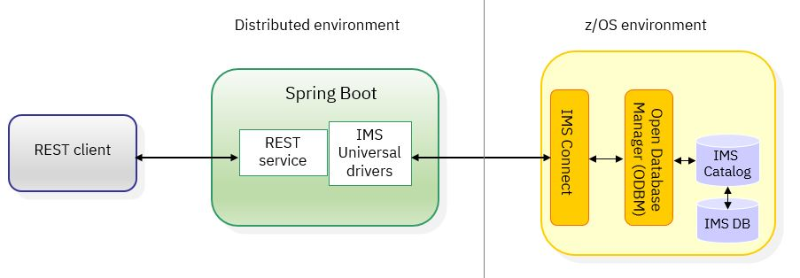
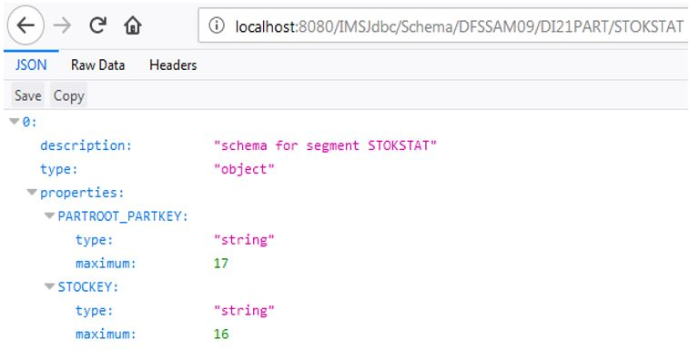
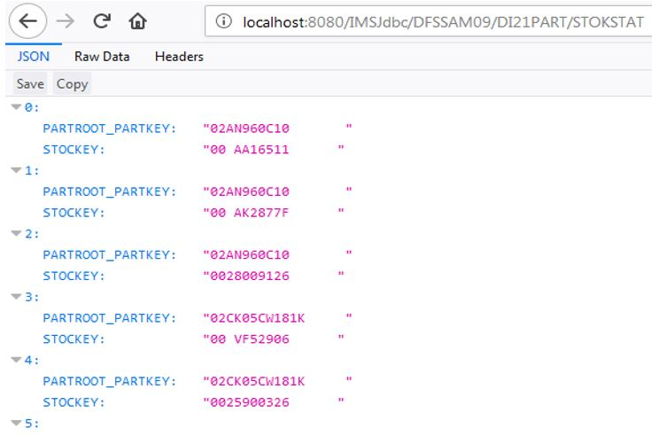

# Accessing IMS data using IMS Universal drivers in Spring Boot Tomcat

In this example we will demonstrate how to use the IMS™ Universal drivers in unmanaged environments such as Spring Boot Tomcat.

The sample workspace contains a sample implementation of REST interfaces for generic queries to IMS databases. 
The implementation requires the use of the IMS catalog and IMS Connect with ODBM configured.
The sample is developed based on IMS V14 and the IMS Universal JDBC driver code drop 14.047.

## Program flow and architecture

The following diagram shows the architecture and technologies involved:


The implementation is based on the [IMS Universal JDBC drivers programming](https://www.ibm.com/support/knowledgecenter/en/SSEPH2_14.1.0/com.ibm.ims14.doc.apg/ims_odbjdbcdatasrcconn.htm) topic in IBM Knowledge Center. 

### Featured technologies

* [Spring Framework](https://spring.io/): An open source application framework and inversion of control container for the Java platform
* [Spring Boot](http://projects.spring.io/spring-boot/): Spring boot is a framework developed on top of the Spring framework to ease the development of new Spring applications.
* [IMS Universal drivers](https://www.ibm.com/support/knowledgecenter/SSEPH2_14.1.0/com.ibm.ims14.doc.apg/ims_odbappprogintro.htm):  
These are a set of Java drivers or resource adapters that provide Java applications with connectivity and access to IMS databases from z/OS® and distributed (non-z/OS) environments through TCP/IP.
* [IMS catalog](https://www.ibm.com/support/knowledgecenter/SSEPH2_14.1.0/com.ibm.ims14.doc.dag/ims_cat_db_overview.htm): 
The IMS catalog contains trusted metadata and definitions of the IMS databases and application program views that are defined to IMS. The IMS catalog simplifies access to IMS databases via database metadata that is stored in the IMS catalog. 

## Background information
The IMS Universal drivers include multiple programming options for accessing IMS data.  
* The <b>IMS Universal Database resource adapter</b> provides connectivity to IMS databases from a Java Platform, Enterprise Edition (Java EE) environment, and access to IMS data using the Common Client Interface (CCI) and Java Database Connectivity (JDBC) interfaces. 
* The <b>IMS Universal JDBC driver</b> provides a stand-alone JDBC 4.0 driver for making SQL-based database calls to IMS databases. 
* The <b>IMS Universal DL/I driver</b> provides a stand-alone Java API for writing granular queries to IMS databases using programming semantics similar to traditional DL/I calls. 
Different "flavors" of the resource adapter and drivers are also available depending on whether local or XA transaction support is required.

The first two-- IMS Universal Database resource adapter and the IMS Universal JDBC driver-- can be used in Java EE environments. They can also be used if you are looking for lightweight Java EE alternatives for micro services and cloud deployment.
This sample shows you how to use the Spring auto configuration feature from `application.properties` and a simple REST interface to:
*	Query IMS databases using a REST JSON interface.
*  Receive the schema from the IMS catalog in JSON format. 

For a generic interface based on REST input parameters, the solution requires the IMS catalog. The sample uses the metadata that is stored in the IMS catalog to provide the schema information and to access the database. This is done by passing the PSB name from the URL as the database name to the DataSource object for every request.

## Software requirements
* <b>The IMS Universal Database resource adapter or the IMS Universal JDBC driver</b>   
The IMS Universal Database resource adapter is packaged as a Resource Adapter Archive ( a .rar file). This file must be extracted
 (by, for example, changing the .rar extension to .zip, and then using a suitable tool to extract the content). Usually it contains a single jar file, `imsudb.jar`. 
This `imsudb.jar` file can also be obtained as the IMS Universal JDBC driver from the directory where the SMP/E installation of the IMS Java component took place. 
For your development convenience, you can also download the IMS Universal JDBC drivers from the [IMS Universal Drivers download site](https://www-01.ibm.com/marketing/iwm/iwm/web/preLogin.do?source=swg-imsUD). 
Because the drivers are the same in V15 and V14, the downloaded drivers will work with both IMS 14 and IMS 15 databases.
*	<b>The latest Eclipse Development Environment (Eclipse IDE for Java Developers)</b>    
Download the latest Eclipse Development Environment. For this sample, oxygen.1 was downloaded and it already contains Maven. Although Eclipse also works with a Java Runtime Environment, Maven builds require a Java Development Kit (or SDK version) to be installed. Keep in mind that the SDK and Eclipse can be either 32-bit or 64-bit versions, but the two need to be the same version.
*	 <b>Spring Boot</b>  
Install Spring Boot. For getting started and installation information, see the [Spring Boot Reference Guide](https://docs.spring.io/spring-boot/docs/current-SNAPSHOT/reference/htmlsingle/).  
* <b>IMS catalog</b>     
For information about IMS catalog setup and database metadata capturing, see the [Implementing open access for Java applications](https://www.ibm.com/support/knowledgecenter/en/SSEPH2_14.1.0/com.ibm.ims14.doc.sk/ims_openacc_getstart.htm) topic in the Open access solution adoption kit.
For a z/OSMF workflow sample on provisioning IMS catalog, see [IMS catalog workflow for z/OSMF GitHub sample](https://github.com/imsdev/ims-devops-zosmf-catalog).

# Workspace and class path
The required `imudb.jar` file needs to be added to the workspace class path in the development environment and to the class path in the runtime environment.
Some customers have added the .jar file into their Maven repository for ease of use. Maven builds then add the required file for the IMS Universal Database resource adapter or IMS Universal JDBC driver to the target build (could be a .jar, .war, or executable .jar file or similar).
For the sample implementation, only a single .jar file, `imsudb.jar` is required (based on the IMS Universal Database resource adapter build 14.047 – version 14.x.x).
Any convenient method of choice can be used, provided the .jar file is part of the development environment and the runtime.

To install the .jar file into the local Maven repository, run a command such as the following:
```mvn install:install-file -Dfile=imsudb.jar -DgroupId=com.ibm.ims -DartifactId=imsudb -Dversion=14.047 -Dpackaging=jar```

The command above would run successfully only if there is a local Maven command installation and the command is run from the directory where the `imsudb.jar` file is located. 
The following files where deployed for use with Spring Boot:
<table>
   <tr>
   <td><b>File</b></td> <td><b>groupId</b></td> <td><b>artifactId</b></td> <td><b>Version</b></td>
   </tr>
   <tr>
   <td>imsudb.jar</td>
   <td>com.ibm.ims</td>
   <td>imsudb</td>
   <td>14.047</td>
   </tr>
   </table>
If you prefer to work without Maven, the .jar file should be added to the classpath manually.

## Development environment

In the Eclipse workspace, create a new Maven project (archtype quickstart) and then add Spring Boot configuration to the `pom.xml` file. Provided in this GitHub repository is a sample workspace that can be imported to get started. 
The required imsudb.jar file from IMS Universal Database resource adapter or IMS Universal JDBC driver can also be added to the workspace classpath without using Maven (just by manually adding it as external to the workspace classpath).

The project contains a Spring Boot application, although we will not provide detailed description on how to create a Spring Boot application here. For more information on Spring Boot and how to get started, refer to Spring Boot tutorials that are widely available on the Internet. 
The Java main Spring Boot application is shown here:
```
import org.springframework.boot.SpringApplication;
import org.springframework.boot.autoconfigure.SpringBootApplication;

@SpringBootApplication(
    scanBasePackages={"sample.ims.springboot.imsdbjdbcrest"})
public class SpringBootMainApp 
{
    public static void main( String[] args )
    {
    	SpringApplication.run(SpringBootMainApp.class, args);
    }
}
```
This code basically starts the application and scans the base packages. The methods marked for the REST operations all implemented in different classes.
In this sample workspace, Spring concepts such as auto configuration, auto wiring and beans are used but they are not described in detail.

## Implementing the helper classes
For the IMS Universal Database resource adapter or the IMS Universal JDBC driver to work in Spring Boot, some helper classes are required to:
* Handle data source configuration.
* Use Spring-provided functionality such as the JdbcTemplate for easier programming.
We will describe what the helper classes are and what they do. For the complete code, however, refer to the sample workspace provided with this sample.

### Spring datasource JDBC configuration and IMSDataSource

To use Spring-provided helper classes and framework for JDBC access, some configuration properties in the `application.properties` or `application.yml` file need to be specified for Spring to instanciate the data source.  
The properties start with `spring.datasource` and unfortunately only the `type` and the` driver-class-name` are actually used.  The other parameters are required for creating the data source.  However, the only requirement is that they are present, so they do not contain any useful values. 

```
# spring jdbc properties for using IMSDataSource
# The first three parameters are not used, but Spring requires them
spring.datasource.url=jdbc:mysql://localhost/test
spring.datasource.username=dbuser
spring.datasource.password=dbpass
spring.datasource.type=com.ibm.ims.jdbc.IMSDataSource
spring.datasource.driver-class-name=com.ibm.ims.jdbc.IMSDriver

# ims db datasource properties
imsdatasource.DatastoreServer=hostname
imsdatasource.PortNumber=9911
imsdatasource.DataStoreName=IMS1
imsdatasource.User=username
imsdatasource.Password=password
imsdatasource.DriverType=4

# tomcat connection pooling parameters
spring.datasource.tomcat.max-wait=20000
spring.datasource.tomcat.max-active=50
spring.datasource.tomcat.max-idle=20
spring.datasource.tomcat.min-idle=15 
```

In addition there are some parameters for the Tomcat connection pooling configuration.
The parameters for the actual IMSDataSource object are configured with the prefix `imsdatasource` and Spring auto configuration was used to load them. 
To do that without redefining the IMSDataSource, a wrapper class was created (`IMSDataSourceConfiguration.java`). This class simply extends IMSDataSource and adds the annotation for spring auto configuration, as shown in the following code snippet:

```
import org.springframework.boot.context.properties.ConfigurationProperties;
import org.springframework.context.annotation.Configuration;

import com.ibm.ims.jdbc.IMSDataSource;

@Configuration
@ConfigurationProperties(prefix="imsdatasource")
public class IMSDataSourceConfiguration extends IMSDataSource{
}

```
Spring auto configuration requires setter methods, and the naming conventions for each of the configuration parameters must match the existing methods in IMSDataSource.
The IMSDataSourceConfiguration is then automatically wired to an IMSDataSource object in the classes that implement JDBC access.

### Implementing IMSJDBCRestApiController

The IMSJDBCRestApiController class implements two methods, for use in the URL, that require the PSB name, PCB name and Segment name as input. 
The response would return either all columns with type and length info (basic Schema), or result records from the data. 
Of course, only fields defined in the catalog are returned. The structure of this schema is not standardized. It is just an example on how metadata can be converted into the JSON format.
The constructor auto-wires the IMSDataSourceConfiguration and configures Spring Framework’s jdbcTemplate with the properties required for the IMS Universal driver to work: 

```
@RestController
@RequestMapping("/IMSJdbc")
public class IMSJDBCRestApiController {
	public static final Logger logger = 
                LoggerFactory.getLogger(IMSJDBCRestApiController.class);
	
        private final JdbcTemplate jdbcTemplate;
        private IMSDataSource imsDataSource;

        @Autowired
        public IMSJDBCRestApiController(JdbcTemplate jdbcTemplate, 
                IMSDataSourceConfiguration imsDataSourceConfiguration) {
    	logger.info("JDBCTemplate set.");
        this.jdbcTemplate = jdbcTemplate;
    	logger.info("IMSDataSource set.");
        this.imsDataSource = (IMSDataSource)imsDataSourceConfiguration; 

        ((IMSDataSource)jdbcTemplate.getDataSource())
           .setDatastoreServer(this.imsDataSource.getDatastoreServer());
        ((IMSDataSource)jdbcTemplate.getDataSource())
           .setDatastoreName(this.imsDataSource.getDatastoreName());
        ((IMSDataSource)jdbcTemplate.getDataSource())
           .setPortNumber(this.imsDataSource.getPortNumber());
        ((IMSDataSource)jdbcTemplate.getDataSource())
           .setUser(this.imsDataSource.getUser());
        ((IMSDataSource)jdbcTemplate.getDataSource())
           .setPassword(this.imsDataSource.getPassword());
        ((IMSDataSource)jdbcTemplate.getDataSource())
           .setDriverType(this.imsDataSource.getDriverType());
        logger.info(this.imsDataSource.getDatabaseName());
    }
...
```

The `getIMSRecordUnqualified` method returns the data records. It is also possible to specify a simple WHERE clause by adding request parameter values in the format of `<key>=<value>` after the URL as part of the GET request for URLs starting with `/IMSJdbc`: 

```
@RequestMapping(value = "/{psbname}/{pcbname}/{segmentname}", 
                   method = RequestMethod.GET)
    public ResponseEntity<?> getIMSRecordUnqualified(
                @PathVariable("psbname") String psbname,
    		@PathVariable("pcbname") String pcbname,
                @PathVariable("segmentname") String segmentname,
    		@RequestParam LinkedHashMap<String, String> requestParams) { 
…
```

For samples, see the <a href="#RESTinterface">Invoking the REST interface section</a>.

The `getIMSSchema` method returns all fields (columns) in the segment (table) in JSON format for URLs starting with `/IMSJdbc/Schema`: 

```
@RequestMapping(value = "/Schema/{psbname}/{pcbname}/{segmentname}", 
                   method = RequestMethod.GET)
    public ResponseEntity<?> getIMSSchema(
                @PathVariable("psbname") String psbname,
    		@PathVariable("pcbname") String pcbname, 
                @PathVariable("segmentname") String segmentname) { 
…
```

The method issues a SELECT statement, which returns one record. Furthermore it implements the private method `convertExceptionToObjectNodeList`, 
which converts a Java exception into an object node and, as such, allows the exception to be displayed in JSON format to the caller of the REST service.

### Implementing JsonNodeRowMapper and JsonSchemaNodeRowMapper

To map one result set row to JSON, the Spring Framework’s jdbcTemplate class uses the so-called RowMappers.  For custom mapping of data types to JSON format, those RowMappers are custom and need to be implemented separately. 

The JsonNodeRowMapper class is implemented to return one or more data records from the IMS database. 
It basically contains code that extracts the field (column) names and the data type from the resultset for one row and adds it to an object node hierarchy. 
All records are combined to a list of nodes, which is then returned to the REST service caller.

The JsonSchemaNodeRowMapper class is for returning the metadata from the result set. It basically contains code that extracts the field (column) names, the data type and length information from the resultset and adds it to an object node hierarchy. All fields (columns) are combined to a list of JSON nodes, which is then returned to the REST service caller.

IMS Universal JDBC driver logging and tracing to a file can be configured here,  but  if the `logging.level.com.ibm.ims.db.opendb` is commented out in the `application.properties` file, it is already prepared for Spring Boot logging to console.

### How to turn on logging for the IMS Universal JDBC driver

To see what is being sent from and to IMS Connect and for general problem determination, it is useful to know how to turn on logging.

In the `application.properties` or `application.yml` file, the logging level needs to be set:
```
logging.level.com.ibm.ims.db.opendb=TRACE
```
Spring uses SLF4J log levels, so mapping the correct `java.util.logging` level is required (for example, in Spring Boot, instead of “FINEST”, use “TRACE”).
Note also that Spring Boot by default does not log the method names. The `logback.xml` file that is part of the project in the `resources/` folder provides the capability that the method name within the IMS Universal JDBC driver is logged.

## Sample project

The sample project is a Maven project exported from pure Eclipse. It has the directory and package structure that adheres to Maven projects.

### Package structure
There are five classes in package sample.ims.springboot.imsdbjdbcrest.
*	The `IMSDataSourceConfiguration.java` class is for auto configuration of the IMSDataSource object. 
*	The `IMSJDBCRestApiController.java` class configures the Spring JDBC template and implements both the REST methods for returning the schema and for returning data from the IMS database. 
*	The `SpringBootMainApp.java` class is the main entry point for running the Spring Boot service. It specifies the package names to be scanned at startup.
*	The `JsonNodeRowMapper.java` class is for returning one or more data records from the IMS database.
*	The `JsonSchemaNodeRowMapper.java`class is for returning the metadata from the result set. 

For the connection to IMS Connect, information such as hostname, portnumber, datastore, username and password are stored in the `application.properties` file in resources (`src/main/resources` in the Maven project) where Spring Boot looks for the `application.properties` or the `application.yml` file. 
Modify this connection information for your environment. 

For turning on logging, enable the logging properties (`#` makes it a comment) in the `application.properties` file. In order to provide the method names, a sample `logback.xml` configuration file is provided in the `resources/` folder as well.
By using Maven build type package, an executable jar file can be built. This file can be run by using the `java -jar <jarfile.jar>` command. This jar file can run on any Java-enabled platform, which includes z/OS.

<a name="RESTinterface"></a>
### Invoking the REST interface

For testing the REST interface, the sample IMS DI21PART database is used with the PSB DFSSAM09. Note that this sample database might not be enabled or installed in your existing IMS system.

The root request mapping for the REST application is `/IMSJdbc`. It needs to be suffixed by the request mapping for the REST methods.

For testing the retrieval of the schema of a segment, the URL would need to be in the format of `/IMSJdbc/Schema/<PSBNAME>/<PCBNAME>/<SEGMENT>`.  A sample output for the DFSSAM09 PSB looks like as follows:



For testing the data access, the following URL would return all segments from the STOKSTAT segment within the DI21PART database:



There are more possibilities. For example the following URL returns only the STOKSTAT segments for the PART number 02AN960C10:
```
http://localhost:8080/IMSJdbc/DFSSAM09/DI21PART/STOKSTAT?PARTROOT_PARTKEY=02AN960C10
```
Note that with the IMS Universal JDBC driver, all higher level keys are part of each lower level segment in the format of `<Segment name>_<key field>` and can be used 
for queries or qualifications in the WHERE clause of SQL statements.

The following query would return the PARTROOT segment for part 02AN960C10:
```
http://localhost:8080/IMSJdbc/DFSSAM09/DI21PART/PARTROOT?PARTKEY=02AN960C10
```

If XML output is wanted instead of JSON, there is no code change necessary. Simply add the following dependency into the `pom.xml` file: 
```
    <dependency>
      <groupId>com.fasterxml.jackson.dataformat</groupId>
      <artifactId>jackson-dataformat-xml</artifactId>
    </dependency>
```

After restarting the server, the output will be XML instead of JSON.

## Gracefully shutting down Spring Boot

For the JDBC connections to be orderly cleaned up, Spring Boot must be shut down gracefully. This is achieved by setting some properties in the `application.yml` 
file that enable the shutdown endpoint for Spring Boot and to turn on security to use it. 

Now an HTTP POST request (the Firefox RESTer plugin can be used for that) to the endpoint URL (without the contextPath property, it would be simply `/shutdown`) can be used to shut down Spring Boot. Based on the original workspace, the URL to shut down Spring Boot would be as follows:
```
http://localhost:8080/shutdown
```
<b>Note</b>: Only GET requests can be issued from the browsers’ URL bar. A POST request cannot.

## Summary

In this sample, a project for the IMS Universal Database resource adapter/IMS Universal JDBC diver implementation was shared for exploitation of a Spring Boot REST Gateway.

Spring Boot apps can be packaged as executable .jar files and can run on any platform that support Java, which includes z/OS.

