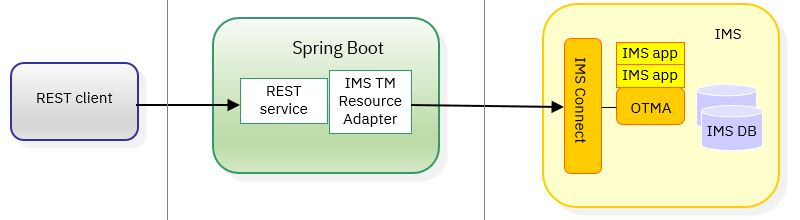
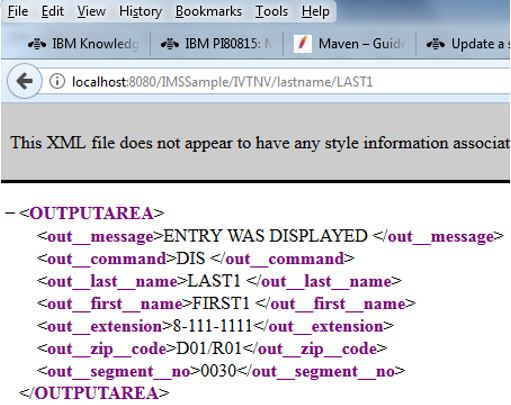

# Spring Boot and IMS microservices using IMS TM Resource Adapter and connection pooling

This example demonstrates how to use connection pooling to call IMS™ transactions as microservices by using the IMS TM resource 
adapter in an unmanaged environment such as Spring Boot with embedded Tomcat.
 
Spring Boot is a suite of pre-configured frameworks and technologies that make it easy to create a Spring web application for up and running on the Spring platform with little configuration.  

The sample project is a Maven project exported from Eclipse.  It contains a sample implementation of a simple pool manager and a REST microservice. The sample project 
demonstrate how to use the Spring Boot auto-configuration feature and some Java™ helper classes to make IMS TM Resource Adapter work as if it were running in a Java EE application server.

The same information in this README is also made available in the `springboot_ims_connection_pooling.pdf` file if you prefer a hard copy.

## Program flow and architecture


The implementation uses the Common Client Interface (CCI), based on the [CCI topic](https://www.ibm.com/support/knowledgecenter/en/SSEPH2_14.1.0/com.ibm.ims14.doc.tmra/topics/cimsCCIoverview.htm) 
in the  IMS TM resource adapter documentation.

## Featured technologies

* [Spring framework](https://spring.io/): An open source application framework and inversion of control container for the Java platform 
* [Spring Boot](http://projects.spring.io/spring-boot/)</a>: Spring boot is a framework developed on top of the Spring framework to ease the development of new Spring applications. 
* [IMS TM Resource Adapter](https://www.ibm.com/support/knowledgecenter/SSEPH2_14.1.0/com.ibm.ims14.doc.tmra/topics/tmresoverview.htm): A Java EE connector architecture (JCA)-compliant resource adapter that allows Java applications or services to access IMS transaction via IMS Connect, or IMS applications to call out to external Java application or services.

## Background information
The [Sample CCI application code](https://www.ibm.com/support/knowledgecenter/en/SSEPH2_14.1.0/com.ibm.ims14.doc.tmra/topics/rimssamplecci.htm) topic in the IMS TM Resource Adapter documentation
 describes a sample implementation that demonstrates how to create a single Connection instance.  A managed Connection Factory object (IMSManagedConnectionFactory) is created, 
 and the generic Connection Factory object (IMSConnectionFactory) is taken from the managed Connection Factory to create the connection object (Connection). However, this Connection instance is not reused.

This sample will show you how to add a pool to the above sample implementation.

Because a Java EE resource adapter is used to run in a non-Java EE environment, a pool manager needs to be implemented and instantiated before being able to implement a connection pool for an unmanaged or non-Java EE environment.

## System requirements

The description and the samples in this article are based on the following setup:
* IMS V14 and IMS TM Resource Adapter V14.1.4. 
Since IMS TM Resource Adapter V14.1.4 contains several defect fixes, it is strongly recommended that you start with this level of maintenance.  
Download IMS TM Resource Adapter from the <a href="https://www.ibm.com/marketing/iwm/iwm/web/preLogin.do?source=imscjd">downloads page</a>.

* Download the latest Eclipse Development Environment (Eclipse IDE for Java Developers). 
For this sample, oxygen.1 was downloaded and it already contains Maven. Although Eclipse also works with a Java Runtime Environment, Maven builds require a Java Development Kit (or SDK version) to be installed. Keep in mind that the SDK and Eclipse can be either 32-bit or 64-bit versions, but the two need to be the same version. 

* Install Spring Boot. 
For getting started and installation information, see the <a href="https://docs.spring.io/spring-boot/docs/current-SNAPSHOT/reference/htmlsingle/">Spring Boot Reference Guide</a>.

### Workspace and class path
Since the IMS TM Resource Adapter is packaged as a Resource Adapter Archive (.rar) file, it cannot be used as is for development and runtime. You must extract the .rar file (such as by renaming it to a .zip file and then use a suitable tool to extract the content). The required .jar files then need to be added to the workspace class path in the development environment and to the class path in the runtime environment.

Some customers have added the .jar files into their Maven repository for ease of use. Maven builds then add the required IMS TM Resource Adapter jars to the target build (could be jar, war, executable jar or similar).

The following is a list of .jar files that were found to be required during the implementation of the pool manager in this project. The list is based on IMS TM Resource Adapter version 14.1.4. Names might vary in other versions.

* `imsico.jar`
* `ccf2.jar`
* `j2ee.jar` <br/>
   <b>Note</b>: Use only outside of Tomcat/Spring Boot. It is found that an older version of javax.servlet classes could cause exceptions. In Spring Boot, use the dependency groupid javax.resource artifactid javax.resource-api version 1.7.
* `despi.jar`
* `marshall.jar`
* `CWYBS_AdapterFoundation-DUP1.jar`
* `icu4j-59_1.jar` <br/>
   <b>Note</b>: The public dependency groupid com.ibm.icu artifactid icu4j version 59.1 can be used too.

Any convenient method of choice can be used if the .jar files are part of the development environment and the run time.
To install these .jar files into the local Maven repository, commands like the following can be run:
`mvn install:install-file -Dfile=imsico.jar -DgroupId=com.ibm.ims -DartifactId=imsico -Dversion=14.1.4 -Dpackaging=jar`

The command above only runs successfully if the following conditions are met:
*	There is a local Maven command installation.
* The command is run from the directory where the .jar files from the IMS TM Resource Adapter .rar file were extracted.  
* The following .jar files are deployed for use with Spring Boot:
<table>
<tr>
<td><b>File</b></td> <td><b>groupId</b></td> <td><b>artifactId</b></td> <td><b>Version</b></td>
</tr>
<tr>
<td>`imsico.jar`</td> <td>com.ibm.ims</td> <td>imsico</td> <td>14.1.4</td>
</tr>
<tr>
<td>`ccf2.jar`</td> <td>com.ibm.ims</td> <td>ccf2</td> <td>14.1.4 </td>
</tr>
<tr>
<td>`despi.jar`</td> <td>com.ibm.ims</td> <td>despi</td> <td>14.1.4</td>
</tr>
<tr>
<td>`marshall.jar`</td> <td>com.ibm.ims</td>  <td>marshall</td> <td>14.1.4</td>
</tr>
<tr>
<td>`CWYBS_AdapterFoundation-DUP1.jar`</td><td>com.ibm.ims</td><td>cwybs-adapterfoundation</td><td>14.1.4</td>
</tr>
</table>

If you prefer to work without Maven, the .jar files should be added to the class path manually. If the sample code is used outside Spring Boot, then the `j2ee.jar` file needs to be added as well.

### Development environment
The latest Eclipse Development Environment (Eclipse IDE for Java Developers) version (oxygen.1 at the time of this project) was downloaded and 
it already contains Maven. Although Eclipse also works with a Java Runtime Environment, Maven builds require a Java Development Kit (or SDK version) 
to be installed. Keep in mind that the SDK and Eclipse can be either 32-bit or 64-bit versions, but the two need to be the same version.

In the workspace, create a new Maven project (archtype quickstart) and then add Spring Boot configuration to the pom.xml file. 
Provided in this GitHub repository is a sample workspace that can be imported to get started. The required .jar files from IMS TM Resource Adapter 
can also be added to the workspace class path without using Maven (just by manually adding it as external to the workspace class path).

Because there is a sample Spring application in the attached workspace that implements a JSON endpoint for the IMS Installation Verification 
Procedure (IVP) sample phonebook transaction IVTNV, there is no detailed description on how to create a Spring Boot application in this document. 
For more information on Spring Boot and how to get started, refer to the tutorials that are widely available on the Internet. 
The input and output records for the IVTNV transaction used in this sample were generated with IBM® Rational® Application Developer 
(Rational Software Architect can also be used) by using the <b>J2C</b> -&gt; <b>CICS/IMS Databinding Generator Wizard</b> (using settings codepage 1141, platform z/OS®, and compile option TRUNC(BIN)).

## Implementing a simple pool manager
The simple pool manager implemented here is a vector that stores connections that are not in use. It uses a counter as boundary and does not 
remove unused connections, and the connections do not time out. The pool manager is basically a repository of unused connections. Due to 
internal IMS TM Resource Adapter processing and callback handlers, in case a connection is closed by the application, the connection is released 
back to the connection pool. Furthermore, since the Security subject is in case of the IMS TM Resource Adapter not bound to the actual physical c
onnection but rather to the IMS Connection Spec, the user can be changed during getConnection: 

```
//create IMS Connection Spec
IMSConnectionSpec ics = new IMSConnectionSpec();
//change userid on connection
ics.setUserName("ZUSER001");
//create Connection
Connection conn = icf.getConnection(ics);
```

This piece of code simply demonstrates the way the `userid` is combined with a connection. The `getConnection` call will result in calling the reserve 
method of the pool manager implementation and returning a physical connection, and during execution, this `userid` will sent to IMS Connect in the 
header information of the IMS request message.

### Interface and class variable
The connection pool (it is called PoolManagerImpl in this sample) needs to implement the  com.ibm.connector2.spi.PoolManager interface. 
It needs to provide a vector for storing the connections and a PrintWriter class for possible logging. This is set by the `setLogWriter` method that is part of the 
PoolManager interface. There are other dependency interfaces required to add some more unimplemented methods.
```
import java.io.PrintWriter;
import java.util.Vector;
import javax.resource.ResourceException;
import javax.resource.spi.ApplicationServerInternalException;
import javax.resource.spi.ConnectionRequestInfo;
import javax.resource.spi.ManagedConnection;
import javax.resource.spi.ManagedConnectionFactory;
import javax.resource.spi.ResourceAllocationException;
import javax.security.auth.Subject;

import com.ibm.connector2.spi.ConnectionPoolProperties;
import com.ibm.connector2.spi.ConnectionStateChangeObserver;
import com.ibm.connector2.spi.ConnectionStateChangeParticipant;
import com.ibm.connector2.spi.PoolManager;

public class PoolManagerImpl implements PoolManager {
	private PrintWriter pw = null;
	private Vector<ManagedConnection> connectionPool = null;
	private int totalConnections = 0;
```

The actual connections are of type ManagedConnection.

### Implementing helper methods
For ease of use, a method for logging, logTrace, was added as follows:
```
private synchronized void logTrace(String msg) {
if (pw != null) {
     pw.println(msg);
             pw.flush();
        }
}
```
It can then be easily used from within the class.

In addition, the getter and setter methods for the logWriter need to be implemented. Below is the `setLogWriter` method: 
```
public void setLogWriter(PrintWriter pw) {
	this.pw = pw;
}
```

This is the `getLogWriter` method: 
```
public PrintWriter getLogWriter() {
	return pw;
}
```

Both methods are derived from the interface.

### Implementing initialization
The initialization method creates the vector and prepopulates the vector with the minConnections amount of physical connections to IMS Connect: 

```
private synchronized void initialize(ManagedConnectionFactory
         factory, ConnectionPoolProperties poolProps,
         ConnectionRequestInfo reqInfo) throws ResourceException {
	 logTrace(" >>> PoolManager.initialize() " + 
                    poolProps.getMinConnections());
	 connectionPool = new Vector<ManagedConnection>();
	 for (int i=0; i<(poolProps.getMinConnections()); i++ ) {
              connectionPool.addElement(
                factory.createManagedConnection(
                        ((javax.security.auth.Subject) (null)), reqInfo));
		totalConnections++;
	 }		
	 logTrace(" <<< PoolManager.initialize()");
} 
```
The totalConnections count is maintained too.

### Implementing synchronized Vector handling
Since the connection pool is running and its methods accessed in a multithreaded environment, access to the vector needs to be synchronized.
Getting a connection from the Vector is implemented in the `getMCfromVector` method:

```
private synchronized ManagedConnection getMCfromVector(
          ManagedConnectionFactory factory, 
          ConnectionPoolProperties poolProps,
          ConnectionRequestInfo reqInfo) throws ResourceException {
     logTrace(" >>> PoolManager.getMCfromVector() " + 
          connectionPool.size());
     if (connectionPool.size() > 0) {
          ManagedConnection mc = 
               (ManagedConnection)connectionPool.firstElement();
	  connectionPool.removeElementAt(0);
          return mc;
     } else {
          if (totalConnections < poolProps.getMaxConnections()) {
                totalConnections++;
                return factory.createManagedConnection(
                     ((javax.security.auth.Subject) (null)), reqInfo);		
          } else {
		throw new ResourceAllocationException(
                     "No connection available", "Max. PoolSize of " + 
                     poolProps.getMaxConnections() + " exceeded.");
          }
     }
}
```

Getting a connection from the Vector is implemented in the `getMCfromVector` method:

```
private synchronized void putMCtoVector(ManagedConnection mc) {
     logTrace(" >>> PoolManager.putMCtoVector() " + 
          connectionPool.size());
     connectionPool.addElement(mc);
     logTrace(" <<< PoolManager.putMCtoVector() " + 
          connectionPool.size());
}
```
Marking the method as synchronized ensures that only one tread is executing the method at a time.

### Implementing pool connection reserve, release, and delete methods

For getting a connection from the pool, the resource adapter calls the reserve method of the PoolManager, implemented as follows: 
```
public ManagedConnection reserve(ManagedConnectionFactory factory,
		ConnectionPoolProperties poolProps, Subject arg2,
		ConnectionRequestInfo reqInfo, Object arg4, 
                boolean arg5)
		throws ResourceAllocationException {
	logTrace(" >>> PoolManager.reserve()");
	if (connectionPool == null) {
		try {
			initialize(factory, poolProps, reqInfo);
		} catch (ResourceException e) {
			e.printStackTrace();				
			ResourceAllocationException e2 = new 
                        ResourceAllocationException(e.getMessage(), 
                                                          e.getCause());
			throw e2;
		}			
	}
	try {			
		ManagedConnection mc = getMCfromVector(factory, poolProps, 
                                                              reqInfo);
		logTrace(" <<< PoolManager.reserve()");
		return mc;
	} catch (ResourceException e) {
		e.printStackTrace();
		return null;
	}
}
```

For putting a connection back to the pool, the IMS TM resource adapter calls the `release` method of the PoolManager, implemented as follows: 

```
public void release(ManagedConnection mc, Object arg1)
		throws ApplicationServerInternalException {
	logTrace(" >>> PoolManager.release()");
	try {
		mc.cleanup();
		putMCtoVector(mc);
	} catch (ResourceException e) {
		e.printStackTrace();
	}
	logTrace(" <<< PoolManager.release()");
}
```

For removing a connection from the pool the resource adapter calls the `remove` method of the PoolManager. It is implemented as follows: 

```
public void delete(ManagedConnection mc, Object arg1)
		throws ApplicationServerInternalException {
	try {
		totalConnections--;
		if (mc != null) mc.destroy();
	} catch (ResourceException e) {
		e.printStackTrace();
	}
}
```

<b>Note</b>: Because this sample pool manager implementation does not keep track of used connections, the `delete` method assumes that 
a connection created by this pool manager instance is removed and therefor simply destroys the physical connection if not null and decrements 
the totalConnections counter.


### Implementing pool shutdown and cleanup
Since calling the close method on the connection causes the `release` method of the pool manager to be called, the connections would not be 
erminated gracefully without a shutdown or cleanup. In order to do a cleanup, a `stop` method was added that removes all connections from 
the vector and physically terminates the connections to IMS Connect using the `cleanup()` and `destroy()` methods on the managed connection: 

```
public void stop() {
     logTrace(" >>> PoolManager.stop() " + connectionPool.size());
     ManagedConnection mc = null;
     if (connectionPool != null) {
          while (connectionPool.size() > 0) {
               mc = (ManagedConnection)connectionPool.firstElement();
               connectionPool.removeElementAt(0);
	       totalConnections--;
    	       try {
                    mc.cleanup();
               } catch (ResourceException e) {
                    e.printStackTrace();
               }
               try {
                    mc.destroy();
               } catch (ResourceException e) {
                    e.printStackTrace();
               }
    	  }
          connectionPool = null;
     }
     logTrace(" <<< PoolManager.stop() " + totalConnections);
}
```

Stopping the pool connection avoids the `HWSP1415E TCP/IP SOCKET FUNCTION CALL FAILED; F=READ` error message issued from IMS Connect 
when a persistent reusable socket is closed without notifying IMS Connect. 

## Using the simple pool manager

In order to use the pool manager, the sample code mentioned at the beginning of the document needs to be changed and enhanced.

### Adding the code to use the pool manager to the sample

Starting with the sample code from the non-JNDI case:  

```
IMSManagedConnectionFactory mcf = new IMSManagedConnectionFactory();
mcf.setDataStoreName("MyDSName");
mcf.setHostName("myHostNm");
mcf.setPortNumber(new Integer(1234));
...
//Create connection factory from ManagedConnectionFactory
cf = (IMSConnectionFactory) mcf.createConnectionFactory();
The following code adds the usage of the pool manager that was created in the implementation section: 
IMSManagedConnectionFactory mcf = new IMSManagedConnectionFactory();
mcf.setDataStoreName("MyDSName");
mcf.setHostName("myHostNm");
mcf.setPortNumber(new Integer(1234));
...
//create DefaultPoolManagerProperties
DefaultConnectionPoolProperties connPoolProps = new 
      DefaultConnectionPoolProperties();
connPoolProps.setMinConnections(3);
connPoolProps.setMaxConnections(6);
			  
//Create PoolManager
poolManager = new PoolManagerImpl();
			  
//Create DefaultConnectionManager
DefaultConnectionManager connMgr = new DefaultConnectionManager();
connMgr.setConnectionPoolProperties(connPoolProps);
//connMgr.setLogWriter(logWriter);	  
connMgr.setPoolManager(poolManager);

//Create connection factory from ManagedConnectionFactory
cf = (IMSConnectionFactory) mcf.createConnectionFactory(connMgr);
```

The sample workspace contains a Java class that implements the usage of the pool manager (same package as the pool manager sample.ims.poolmanager 
with class name StandaloneIMSCall.java).

### How to turn on logging for IMS TM Resource Adapter

In order to see that the connections are reused and to assist problem determination, it is useful to know how to turn on logging. 
The following sample shows how to do logging in a J2SE environment. The log is sent to the console, and it also works for Eclipse tooling.

```  
//turn on logging if required	  
final Logger universalLogger = Logger.getLogger("com.ibm.j2ca.*");
universalLogger.setLevel(Level.FINEST);
try {
     StreamHandler sh = new StreamHandler(
                                 System.out, new SimpleFormatter());
     sh.setLevel(Level.FINEST);
     universalLogger.addHandler(sh);
} catch (Exception e1) {
     e1.printStackTrace();
}
...
//Create LogUtil
LogUtils logUtils = new LogUtils(new IMSResourceAdapter(), true);
//turn on logging if required
logUtils.setLogger(universalLogger);
...
//turn on logging if required
mcf.setLogUtil(logUtils);
```

<b>Note</b>: The log level needs to be set on both the logger instance and the stream handler.

The following sample shows how to do logging in a J2SE environment (to a file):  

```
//turn on logging if required	  
final Logger universalLogger = Logger.getLogger("com.ibm.j2ca.*");
universalLogger.setLevel(Level.FINEST);
try {
     FileHandler fh = new FileHandler("C:\\IMSTMRATrace.txt");
     fh.setFormatter(new SimpleFormatter());
     universalLogger.addHandler(fh);
} catch (Exception e1) {
     e1.printStackTrace();
}
...
//Create LogUtil
LogUtils logUtils = new LogUtils(new IMSResourceAdapter(), true);
//turn on logging if required
logUtils.setLogger(universalLogger);
...
//turn on logging if required
mcf.setLogUtil(logUtils);
```

<b>Note</b>: For the file handler, the log level does not need to be set.

Logging in Spring Boot is easier to implement because it does not require to create a file or stream handler:  

```
//IMSTMRA uses java.util.logging
final Logger universalLogger = Logger.getLogger("com.ibm.j2ca");
LogUtils logUtils = new LogUtils(new IMSResourceAdapter(), true);
//using slf4j does not work here, the cast to java.util.logging fails
logUtils.setLogger(universalLogger);			
mcf.setLogUtil(logUtils);
```

Of course, the logging level needs to be set in the `application.properties` or `application.yml` file:

`logging.level.com.ibm.j2ca=TRACE`

Spring uses SLF4J log levels, so mapping the correct java.util.logging level is required (e.g. instead of FINEST in Spring Boot, 
TRACE needs to be used). An example is commented out in the `application.yml` file that is part of the sample project.
Please also note that Spring Boot by default does not log the method names. This is because IMS TM Resource Adapter uses a helper method.


## Sample project walkthrough 
The sample project is a Maven project exported from Eclipse.  It has the directory and package structure that adheres to Maven projects.

### Pool manager implementation and standalone exploitation:

These are two classes (`PoolManagerImpl.java` and `StandaloneIMSCall.java`) in package sample.ims.poolmanager.

The input and output records (`INPUTMSG.java` and `OUTPUTAREA.java`) for the IMS transaction are generated from COBOL source with the J2C CICS/IMS Data Binding wizard 
from package sample.ims.springboot.inbound.records. They are required to run the `StandaloneIMSCall.java` sample.

The properties for the connection to IMS Connect such as host name, port number, data store, username and password are in the Java code and need to be adjusted based on the IMS system you are using for invoking the IVTNV transaction.


### Spring REST service implementation
There are four classes in package sample.ims.springboot.inbound:
* The `IMSManagedConnectionFactoryProperties.java` class uses the auto-configuration feature in Spring to load all properties that are prefixed with `imsmcf`, 
stores them inside the class, and a `getIMSConnection` method returns a connection to be used in the REST controller. Based on the property connectionpoolenabled, it either uses the simple pool manager or not. 
The @Value annotation is used to set some default values.
* The `SpringMainApp.java` class is just the main entry point for running the Spring Boot service. It simply specifies the package names to be scanned at startup.
* The `StringError.java` class is a custom class for returning a string error message.
* The actual implementation of the RestController (that listens to the HTTP GET request and returns the data) is in class IVTNVRestApiController.java.

For the connection to IMS Connect, related properties such as host name, port number, data store, username and password are in the `application.yml` file in src/main/resources where Spring Boot looks
 for the `application.properties` or the `application.yml` file. Adjust these property values based on your environment to invoke the IVTNV transaction.

For turning on logging, simply enable the logging properties (`#` makes it a comment) in the `application.yml` file.

The input and output records (`INPUTMSG.java` and `OUTPUTAREA.java`) for the IMS transaction generated from COBOL are required to run the REST service. 
For the output conversion to JSON, the `OUTPUTAREA.java` class is used (so the generated attribute names will be the tags in the JSON output). 
The getter method for which the output is not wanted in the result (e.g. fields ll, zz, output_line, the byte array and more) they are marked with `@JsonIgnore` 
so they are not part of the JSON output.

If XML output is wanted instead of JSON, there is no code change necessary. Simply add the following dependency into the `pom.xml` file: 

```
    <dependency>
      <groupId>com.fasterxml.jackson.dataformat</groupId>
      <artifactId>jackson-dataformat-xml</artifactId>
    </dependency>
```
	
After restarting the server, the output will be XML instead of JSON.

### Invoking the service
Based on the contextPath setting in the `application.yml` file and on the `@RequestMapping` annotations at class and method level, 
the URL for the HTTP GET request is as follows:

`http://localhost:8080/IMSSample/IVTNV/lastname/LAST1`

This is similar to using the lastname=LAST1 query string. Since there are 6 entries (LAST1 thru LAST6) in the database for the IVTNV transaction, 
feel free to change the values as needed for testing.
JSON output looks as follows:


XML output (after adding the dependency for XML) looks as follows:



The names for the XML tags or JSON name-value pairs are derived from the COBOL definitions into the generated Java class (`OUTPUTAREA.java`).
 If that’s not wanted, the annotation `@JsonProperty("newname")` with the new name on the getter method for the attribute can be used. 
 For the root tag or name `@JsonRootName` annotation can be used. Unfortunately, since the Java classes generated from COBOL need to be edited to do this, 
 changes will be lost in case of a regenerated class or a new version. In the sample workspace, there are commented out annotations. 
 If they are activated, the names in the output change. For example, a resulting XML then looks like this:


Same is true for JSON.

### Gracefully shutting down Spring Boot

To avoid the HWSP1415E error messages, it is required to shut down the pool. This is achieved by adding a `destroy()` method in the 
IMSManagedConnectionFactoryProperties.java class and mark it with the `@PreDestroy` annotation. This method will be called, if Spring Boot 
is gracefully shut down. This is achieved by setting some properties in the `application.yml` file to enable the shutdown endpoint for Spring Boot 
and to turn on security to use it. 

Now an HTTP POST request (Firefox HTTP Requester plugin can be used for that) to the endpoint URL (which is again based on the contextPath property) 
can be used to shut down Spring Boot. Based on the original workspace, this would be the following URL:

`http://localhost:8080/IMSSample/shutdown`

<b>Note</b>: Only GET requests can be issued from the browsers’ URL bar. A POST request cannot.


## Summary

In this sample, a simple pool manager for IMS TM Resource Adapter implementation was shared for exploitation in non-Java EE runtime environments. A Spring Boot sample is included to demonstrate how to enable an IMS transaction as a REST service with Spring Boot.

